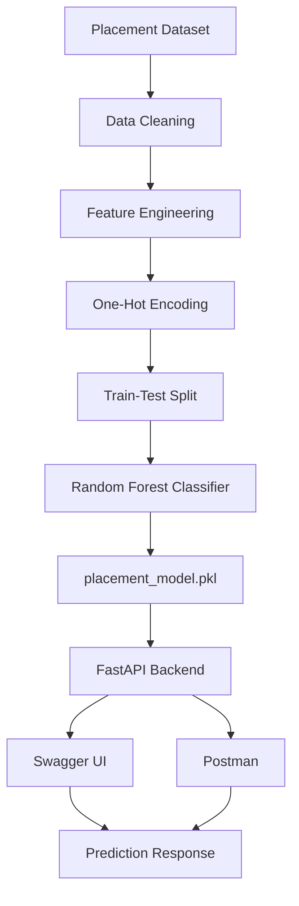
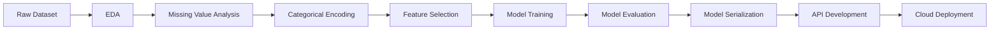
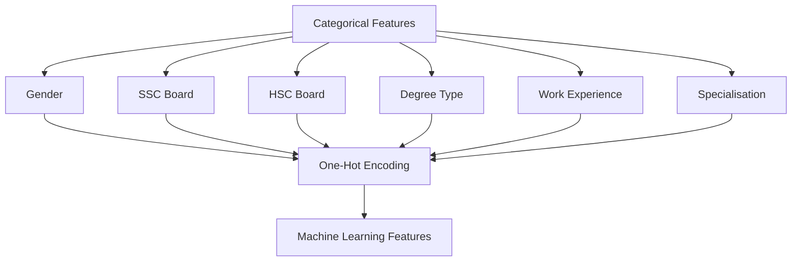
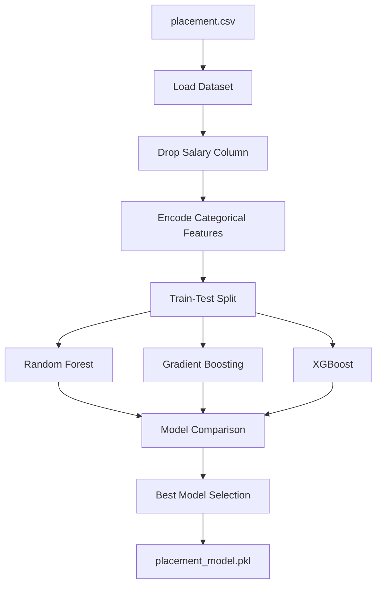
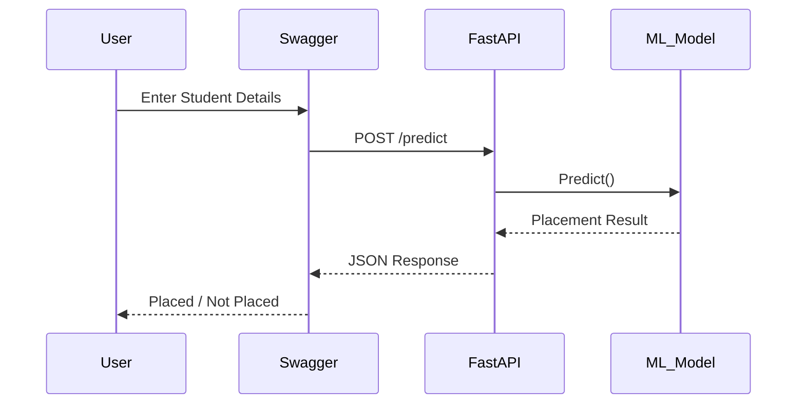
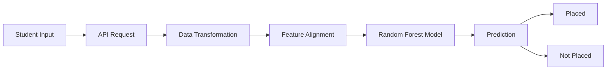
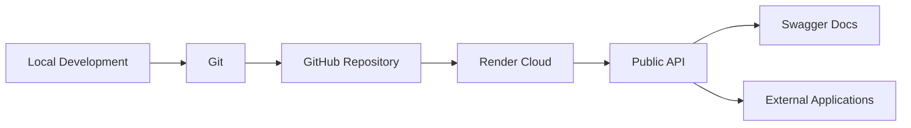

# 🎓 Student Placement Predictor

A Machine Learning-powered web application that predicts whether a student is likely to be placed based on academic performance, educational background, work experience, and employability factors.

---

# 🚀 Project Overview

This project uses Machine Learning to analyze student records and predict placement outcomes.

The solution covers the complete ML lifecycle:

* Data Collection
* Data Cleaning
* Feature Engineering
* Model Training
* Model Evaluation
* FastAPI Backend Development
* REST API Creation
* Cloud Deployment

---

# 🎯 Problem Statement

Can we predict whether a student will get placed based on their:

* SSC Performance
* HSC Performance
* Degree Performance
* MBA Performance
* Work Experience
* Employability Test Score
* Academic Background

This project solves that problem using supervised machine learning classification techniques.

---

# 🏗️ System Architecture



---

# 🔄 Machine Learning Workflow



---

# 📂 Project Structure

```text
student-placement-predictor/

│
├── placement.csv
├── train_model.py
├── app.py
├── placement_model.pkl
├── feature_names.pkl
├── requirements.txt
├── README.md
```

---

# 📊 Dataset Information

Dataset Source:

Campus Placement Dataset (Kaggle)

Features:

| Feature        | Description                   |
| -------------- | ----------------------------- |
| gender         | Student Gender                |
| ssc_p          | Secondary School Percentage   |
| ssc_b          | SSC Board                     |
| hsc_p          | Higher Secondary Percentage   |
| hsc_b          | HSC Board                     |
| hsc_s          | HSC Stream                    |
| degree_p       | Degree Percentage             |
| degree_t       | Degree Type                   |
| workex         | Work Experience               |
| etest_p        | Employability Test Percentage |
| specialisation | MBA Specialisation            |
| mba_p          | MBA Percentage                |

Target Variable:

```text
status
```

Values:

```text
Placed
Not Placed
```

---

# 📈 Feature Engineering Pipeline



---

# 🧠 Model Training Pipeline



---

# 🤖 Models Evaluated

The following machine learning algorithms were evaluated:

* Random Forest Classifier
* Gradient Boosting Classifier
* XGBoost Classifier

Best Performing Model:

```text
Random Forest Classifier
```

Accuracy Achieved:

```text
83.72%
```

---

# 🌐 API Architecture



---

# ⚙️ API Endpoints

## Home Endpoint

```http
GET /
```

Response:

```json
{
    "message": "Student Placement Prediction API Running"
}
```

---

## Prediction Endpoint

```http
POST /predict
```

Example Request:

```json
{
  "gender": "M",
  "ssc_p": 75,
  "ssc_b": "Central",
  "hsc_p": 70,
  "hsc_b": "Central",
  "hsc_s": "Science",
  "degree_p": 72,
  "degree_t": "Sci&Tech",
  "workex": "No",
  "etest_p": 80,
  "specialisation": "Mkt&HR",
  "mba_p": 70
}
```

Example Response:

```json
{
  "prediction": "Placed"
}
```

---

# 🎯 Prediction Pipeline



---

# ☁️ Deployment Architecture



---

# 🚀 Run Locally

Install Dependencies:

```bash
pip install -r requirements.txt
```

Start FastAPI Server:

```bash
uvicorn app:app --reload
```

Open:

```text
http://127.0.0.1:8000/docs
```

---

# 🛠️ Tech Stack

### Machine Learning

* Python
* Pandas
* NumPy
* Scikit-Learn
* XGBoost
* Joblib

### Backend

* FastAPI
* Uvicorn

### Deployment

* Git
* GitHub
* Render

---

# 📌 Key Learning Outcomes

This project demonstrates practical experience in:

✅ Data Cleaning

✅ Feature Engineering

✅ Machine Learning Classification

✅ Model Evaluation

✅ FastAPI Development

✅ REST API Design

✅ Swagger Documentation

✅ Git & GitHub

✅ Cloud Deployment using Render

---

# 📈 Future Improvements

* Hyperparameter Tuning
* Cross Validation
* Feature Importance Analysis
* Streamlit Dashboard
* Docker Containerization
* CI/CD Pipeline
* Automated Model Retraining

---

# 👨‍💻 Author

**Harsh Aryan**

B.Tech Electronics & Communication Engineering

Interests:

* Machine Learning
* Data Science
* Artificial Intelligence
* Backend Development
* Cloud Deployment
