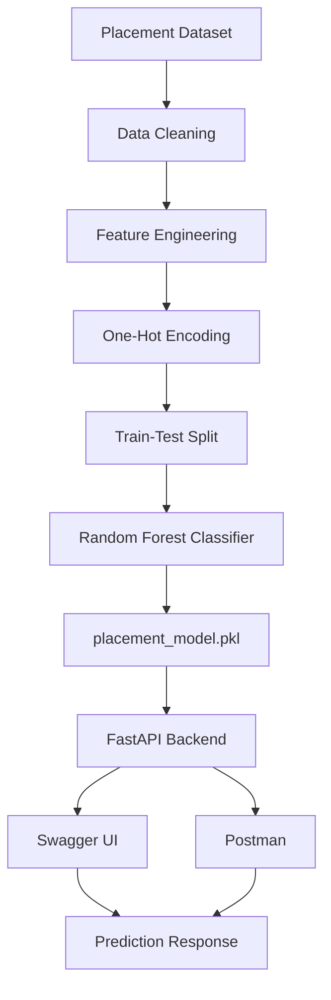
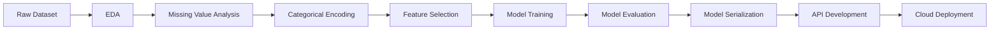

# 🎓 Student Placement Predictor

A Machine Learning project that predicts whether a student is likely to be placed based on academic performance, work experience, and other educational factors.

## 🚀 Live Demo

Coming Soon (Render Deployment)

---

# 📌 Project Overview

This project uses Machine Learning to analyze student academic records and predict placement status.

The model is trained on a placement dataset and exposed through a FastAPI REST API that can be tested using Swagger UI or Postman.

---

# 🎯 Problem Statement

Can we predict whether a student will get placed based on:

- SSC Percentage
- HSC Percentage
- Degree Percentage
- MBA Percentage
- Work Experience
- Educational Background
- Employability Test Score

This project solves that classification problem using supervised machine learning.

---

# 🏗️ System Architecture



# 📂 Project Structure

```text
student-placement-predictor/
│
├── app.py
├── train_model.py
├── placement.csv
├── placement_model.pkl
├── feature_names.pkl
├── requirements.txt
├── README.md
```

---

# 📊 Dataset Features

| Feature | Description |
|----------|-------------|
| gender | Student Gender |
| ssc_p | Secondary School Percentage |
| ssc_b | SSC Board |
| hsc_p | Higher Secondary Percentage |
| hsc_b | HSC Board |
| hsc_s | HSC Stream |
| degree_p | Degree Percentage |
| degree_t | Degree Type |
| workex | Work Experience |
| etest_p | Employability Test Percentage |
| specialisation | MBA Specialisation |
| mba_p | MBA Percentage |

Target Variable:

```text
status
```

Values:

```text
Placed
Not Placed
```

---

# 🧠 Machine Learning Workflow

## Step 1: Data Collection

Dataset obtained from Kaggle.


---

## Step 2: Data Exploration

Performed:

- Missing value analysis
- Feature inspection
- Data type analysis
- Target distribution check

---

## Step 3: Feature Engineering

Categorical features converted using:

```python
pd.get_dummies()
```

Examples:

```text
Gender → Male/Female
Work Experience → Yes/No
Specialisation → Mkt&Fin / Mkt&HR
```

---

## Step 4: Model Training

Models Tested:

- Logistic Regression
- Random Forest Classifier
- Gradient Boosting Classifier
- XGBoost Classifier

Best Model:

```text
Random Forest Classifier
```

Accuracy Achieved:

```text
83.72%
```

---

## Step 5: Model Serialization

Trained model saved using:

```python
joblib.dump()
```

Generated files:

```text
placement_model.pkl
feature_names.pkl
```

---

## 🌐 API Development

Built using:

```text
FastAPI
```

Endpoints:

### Home

```http
GET /
```

Response:

```json
{
  "message": "Student Placement Prediction API Running"
}
```

Example Request:

```json
{
  "gender": "M",
  "ssc_p": 75,
  "ssc_b": "Central",
  "hsc_p": 70,
  "hsc_b": "Central",
  "hsc_s": "Science",
  "degree_p": 72,
  "degree_t": "Sci&Tech",
  "workex": "No",
  "etest_p": 80,
  "specialisation": "Mkt&HR",
  "mba_p": 70
}
```

Response:

```json
{
  "prediction": "Placed"
}
```

```mermaid
sequenceDiagram

participant User
participant Swagger
participant FastAPI
participant ML_Model

User->>Swagger: Enter Student Details

Swagger->>FastAPI: POST /predict

FastAPI->>ML_Model: Predict()

ML_Model-->>FastAPI: Placement Result

FastAPI-->>Swagger: JSON Response

Swagger-->>User: Placed / Not Placed
---

### Predict Placement

```http
POST /predict
```
---

# ⚙️ Installation

Clone repository:

```bash
git clone https://github.com/Harsharyan05/student-placement-predictor.git
```

Move into project:

```bash
cd student-placement-predictor
```

Install dependencies:

```bash
pip install -r requirements.txt
```

---

# ▶️ Run Locally

Start FastAPI server:

```bash
uvicorn app:app --reload
```

Open:

```text
http://127.0.0.1:8000/docs
```

---

# 🛠️ Tech Stack

### Machine Learning

- Scikit-Learn
- Pandas
- NumPy
- Joblib

### Backend

- FastAPI
- Uvicorn

### Deployment

- GitHub
- Render

---

# 📈 Future Improvements

- Hyperparameter Tuning
- Cross Validation
- Feature Importance Visualization
- Streamlit Frontend
- Docker Deployment
- CI/CD Pipeline

---

# 👨‍💻 Author

HARSH ARYAN

B.Tech Electronics and Communication Engineering

Interested in:

- Machine Learning
- Data Science
- Artificial Intelligence
- Backend Development

---

# ⭐ If you found this project useful

Give it a star on GitHub.
